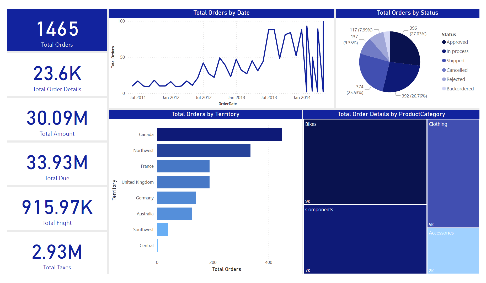

# Market Sales Dashboard

## Overview
This project involves analyzing market sales data to uncover insights related to sales performance, product categories, territories, and additional costs like tax and freight. The data has been cleaned using **Power Query**, and a **Star-Schema Model** was created to organize the information.

The dashboard was developed using Power BI, providing a visual representation of key metrics and trends. It allows for an in-depth analysis of sales performance across different territories, shipping methods, and product categories, helping to identify sales trends and potential areas for improvement.

## Dataset Overview
The dataset consists of sales data from various territories, including order details like product, category, shipping method, and costs such as tax and freight. It tracks information for each order, including quantities, unit prices, total due amounts, and shipment statuses across different time periods. Columns include fields such as order details, order date, and territory.

## Dashboard
The Power BI dashboard offers insights into overall sales performance, product categories, territories, and additional costs like tax and freight. It provides a comprehensive view of sales quantities, total revenue, and breakdowns by territory and product category.

## Tools
- **Power Query**: Data cleaning and transformation.
- **Power BI**: Dashboard creation and visualization.
